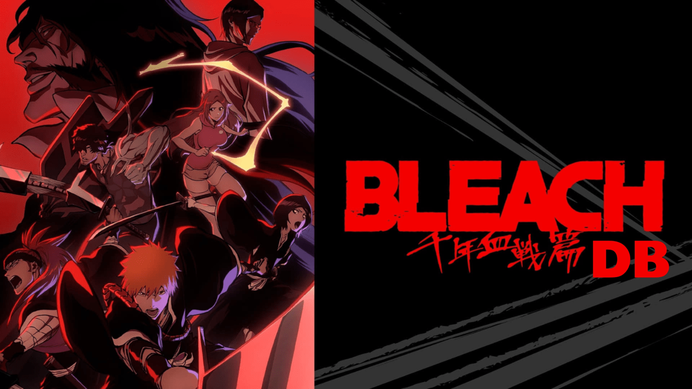

# The Bleach Database

I'm trying to create an absolute database for the Bleach Universe.

All the data has been harvested from [Bleach Fandom Wiki](https://bleach.fandom.com/wiki/Bleach_Wiki).
So I want to thank all creators over there.

# Data

- Characters
    - `Log File`
    - ArranCar
    - Humans
    - Quincy
    - Shinigami

`Log file` conatins an overview of total aggregate data present in the database.

# Charater Data Schema

Use UTF-8 encoding to support all Kanji characters.

```
.
├── id
├── slug
├── name
│   ├── english
│   ├── kanji
│   └── romaji
├── description
├── avatar
├── stats
│   ├── race
│   ├── birthday
│   ├── gender
│   ├── height
│   ├── weight
│   ├── voices
│   └── _other data_
├── media
│   ├── source/url
│   └── alt
└── quotes
    ├── quote
    ├── to
    └── reference
```

**NOTE:** Quotes might be optional for some characters.

# Avatars

256x256px PNG character avatars are saved in the `images` folder, organized by `race`.

```
images/
├── arrancar/
├── humans/
├── quincy/
└── shinigami/
```

# Scraping Files

1. **main.py**
   This is the main file for scraping all data. It arranges character data into JSON files under the `data` folder.

2. **add_slugs.py**
   This file adds slugs to individual characters based on their `id`.

3. **fetch_images.py**
   This file saves images for each character in the `images` folder. It also center-crops and scales down the images to 256x256px squares.
